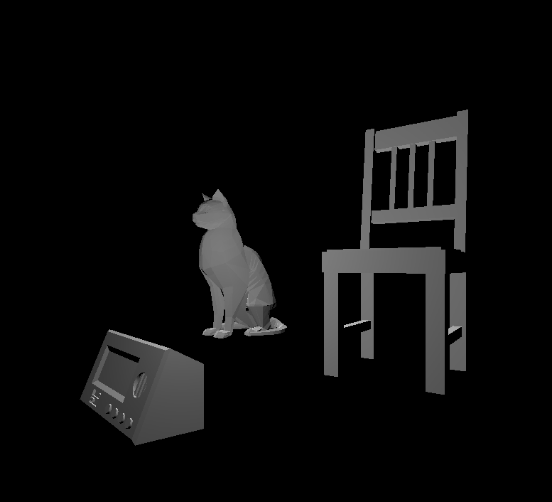

# CMPM163Labs
## Lab2: https://drive.google.com/file/d/1UYj_EKKP0A_NvElDIGpYD4HpztFmEBZH/view?usp=sharing
## Lab3: https://drive.google.com/file/d/15cITrWVt6_4IxNS_Orm8ayePJYI_XAdb/view?usp=sharing

Lab3 Writeup:
From left to right: 
Wireframe cube was made by creating a cube with MeshNormalMaterial and setting the wireframe variable to true.
Middle top cube was created by interpolating on a different axis than the example and used different colors. 
Center cube is just the example cube shown to us. 
Rightmost cube is just the example cube shown to us.

## Lab4: https://drive.google.com/file/d/11JUkv7FZLIFr_n9JUMFYYmusCmMCFDfq/view?usp=sharing 

Question Answers
a. x = 7u
b. y = 7 - 7v
c. Grey

How I Made the Cubes
Starting from left to right, I simply followed the instructions for the first and second cubes. 
The rightmost cube simply was changing the textures and adding a different normal map. 
The center-top cube was created by following instructions. 
The final cube with the tiled texture was simply doing mod(vUv*2.0, 1.0).

## Lab5: https://drive.google.com/file/d/1Ud0nRmG4grfbBhSNcByay4vMBbyNZBPw/view?usp=sharing

Modifications:
Skybox - Changed it to a dark purple material. Rather simple, just went to window > rendering > light settings, and then replaced it. 
Trees - Changed the saturation on the trees so that they more accurately represent the change in colors as the day turns to night.
Track - Made the track longer by redirecting the turns so that there was an extra portion.
Environment - Added two stock buildings from the assets. 
The Sun - Changed the material in order to make it more closely resemble a full moon.
Basic wheel particles - Followed the tutorial, but then changed the material to make them yellow/gold.
Smoke particles from exhaust - Created a new particle system which inherits velocity from parent and exists in a global scope rather then local scope.
Kart speed - Simply increased the speed of the kart to make it a bit more exhilarating.

## Lab6:

Spotlight: Affected by both position and rotation. Lights an area in a cone with a given angle.
Directional light: Behaves like the sun. Not affected by positon. Lights all objects in a scene given the light's rotation.
Point light: Behaves like a light bulb, and not affected by rotation. Lights an area around a single point.
Area light: Only work when using baking a light map. Shines in all directions on one side of a rectangular plane.

I made the material I chose look like real-life object by using the Standard shader and making it metallic. In order to give it a brushed metal look I increased the roughness.

The first textured object uses a cobbled stone texture. 
The second textured object uses a marble texture.

The skybox is just a space skybox I found and thought was cool.

